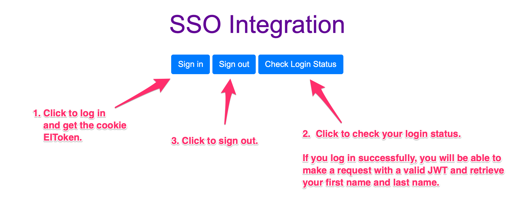

# SSO Front-end Integration

This example shows how to implement SSO front-end integration for the EnSaaS 4.0, which utilizes the default log-in page provided by WISE-PaaS. This default log-in page can be integrated with all applications deployed onto the platform.


# Result



# Components

## index.html

### Sign-in Button

```html
<button type="button" id="signInBtn" class="btn btn-primary">Sign in</button>
```


### Check Log-in Status Button

```html
<button type="button" id="checkLogin" class="btn btn-primary">Check Login Status</button>

```


### Sign-out Button

```html
<button type="button" id="signOutBtn" class="btn btn-primary">Sign out</button>
```


## main.js

### Global Variables

```javascript
const ssoUri = 'https://portal-sso-ensaas.sa.wise-paas.com';
const apiBase = 'https://api-sso-ensaas.sa.wise-paas.com'
const redirectUri = 'https://ssofrontend-devspace-eks004.sa.wise-paas.com/index.html';
```


### Signing in

```javascript
$('#signInBtn').click(function () {
  window.location.href = ssoUri + '/home/sign-in?redirectUri=' + redirectUri;
});
```


### Check Log-in Status

```js
$('#checkLogin').click(function () {
  $.ajax({
    url: apiBase + '/v4.0/users/me',
    method: 'GET',
    xhrFields: {
      withCredentials: true
    }
  }).done(function (user) {
    alert('Hello! ' + user.firstName + ' ' + user.lastName + '!');
  }).fail(function () {
    alert('You are not logged in!');
  });
});
```


### Signing out

```js
$('#signOutBtn').click(function () {
  $.ajax({
    url: apiBase + '/v4.0/auth',
    method: 'DELETE',
    xhrFields: {
      withCredentials: true
    }
  }).done(function (user) {
    alert('You have logged out!');
  }).fail(function () {
    alert('Logging out failed!');
  });
});
```

